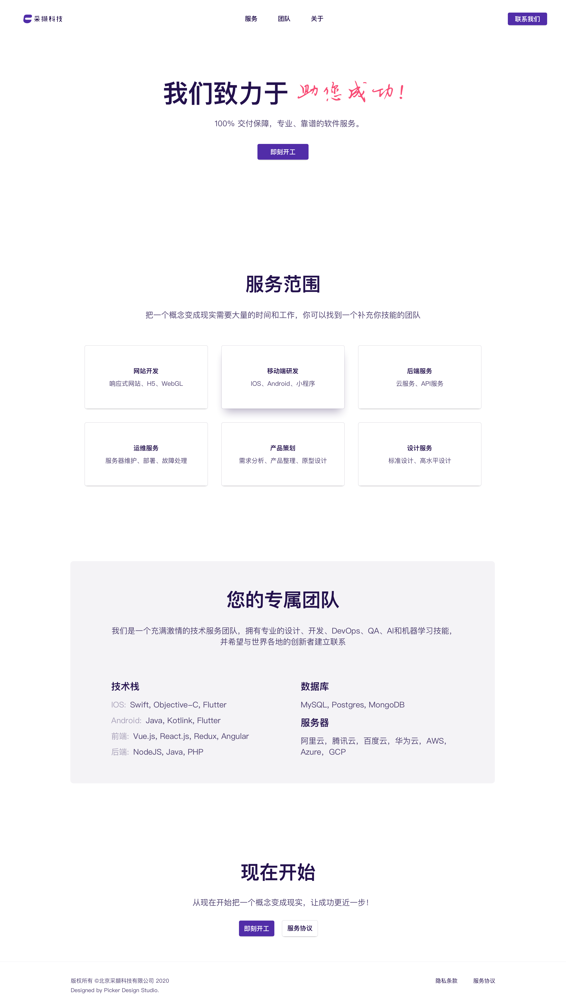

## 前言
因为以前团队做业务和自己做的远程工作，都是熟人或老用户，也就从来没有想着筹备一个面向用户的宣传服务网站。但最近收益也不太好，并且一些客户也希望能在项目进行的过程能有效的跟踪和交流，所以就有了一个搭建出一个为技术公司展示和服务的轻量级运营系统的想法。

首先我们有两块需求：

**一、官网**
    一期需求也比较简单，要有一个良好的落地页，有基础的业务展示功能、友好的视觉效果、有效的客户服务入口、有效的SEO支持

**二、客户服务系统**
    需要项目管理功能、进度看板、跟踪管理、文档管理，最好也能有技术项目的代码审核

基础这两块的需求，我们做了一个调研最终工作选型如下：

官网的设计和技术选型：

- UI：Sketch+Zplin，方便调整和修改
- 前端实现：vuejs nuxtjs 架构，方便扩展、SEO，我们也非常熟悉这套技术的实现

- 客户服务系统：
    选择的是 Phabricator，Phabricator 最早是 Facebook 的内部审查工具。我们选择它，首先在运行机制上非常好，传统的概念上，项目、仓库和任务都是以项目为主绑定在一起的。而在在 Phabricator，所有这些都不是耦合在一起的。项目就是项目，仓库就是仓库，任务就是任务。但所有的东西都是以项目作为线索连接在一起的。

  并且它的代码仓库的支持很完整。Git，Svn，HG 一个都不落下（什么，你说 CVS，那是什么）。对于仓库，Phabricator 有很好的自动检测和拉取机制，你推的代码，很快它就能收到，根据你定制的规则去指派给相应的人去审核

  然后，辅助工具也很丰富，对于开发之外的各种需求来说都可以满足。比如文档、图片审查、倒计时、问答、代码分享、投票、密钥管理、日历、聊天、文件共享简直是费尽心思。
——部分介绍来源知乎 https://www.zhihu.com/question/19977889/answer/24101951

综合这些因素，我们也去安装试用，发现非常好很匹配我们当下的需求。

好，选型做好了，我们就开始实操：

[一、设计篇](https://www.jianshu.com/p/e871803e86f7)

[二、前端实现篇](https://www.jianshu.com/p/b50033b13faa)

三、服务器运维篇

四、Phabricator 系统篇

五、运营

** 资源 **
[https://github.com/caixie-team/caixie-website-nuxtjs](https://github.com/caixie-team/caixie-website-nuxtjs)
[https://caixie.top](https://caixie.top)
[Sketch UI 设计稿源文件]() -- 待上传

# caixie-team-website

> My wicked Nuxt.js project

## Build Setup

``` bash
# install dependencies
$ yarn install

# serve with hot reload at localhost:3000
$ yarn dev

# build for production and launch server
$ yarn build
$ yarn start

# generate static project
$ yarn generate
```

For detailed explanation on how things work, check out [Nuxt.js docs](https://nuxtjs.org).
